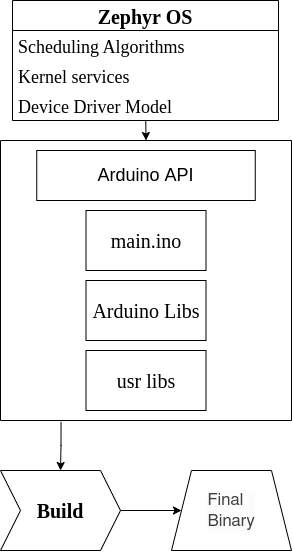

# GSoC'22- Arduino module based on Zephyr

The project idea is to create a Zephyr module that leverages the Arduino Core so that a developer can use Zephyr as the underlying OS when they use the Arduino framework on Arduino-compatible devices.

## About
- _Student Name:_ [Dhruva Gole](https://dhruvagole.tech)
- _Mentors:_ Jonathan Beri, Alvaro Viebrantz, Mike Szczys
- _GSoC Entry link:_ [Program Project Page](https://summerofcode.withgoogle.com/programs/2022/projects/CLdtJiEB)
- _Wiki:_ [Github Issues on zephyr](https://github.com/zephyrproject-rtos/zephyr/issues/32621)
- _Blog Link:_ [Arduino Module based on Zephyr](https://dhruvag2000.github.io/Blog-GSoC22/)  

## Table of Contents
1. [Introduction](#intro)
2. [Implementation Details](#implementation)
3. [Benefit](#benefit)
4. [References](#ref)

## Introduction 

### About Zephyr OS
The [Zephyr OS](https://docs.zephyrproject.org/latest/introduction/index.html) is based on a small-footprint kernel designed for use on resource-constrained and embedded systems: from simple embedded environmental sensors and LED wearables to sophisticated embedded controllers, smart watches, and IoT wireless applications.

## Implementation Details 

**Summary of Discussion: Supporting the Arduino ecosystem:**

@soburi developed a proof-of-concept trying to make it simple to import Zephyr as a library in the Arduino IDE. See https://github.com/soburi/arduino-on-zephyr. It proved to create a lot of maintenance overhead (as currently implemented), but shows it is possible.

The insights from this experimental arduino package were:
- Arduino-API is stable and since most functions are already provided from Zephyr, we need only to go ahead and implement improvements of wrappers.  However, review potential issue [here#22247](https://github.com/zephyrproject-rtos/zephyr/issues/22247).
- **Building source:** Arduino source is built by ``arduino-builder`` system. That is far from general ``make`` systems. The difference of build system between Arduino and Zephyr is based on their fundamental of design and so the hack will remain till the end most probably.
- **Board Configuration:** Config file is frequentry need to create in Zephyr development, But not considered in Arduino IDE.
Arduino prefers to configure peripherals in the code unlike zephyr where config is done outside the code like a ``prj.conf`` file.

- We can use tools such as west command and PlatformIO that already support Zephyr. It also can support compilation of ``.ino`` files by implementing a CMake rule. In this case, different with Arduino is only that need to contain 'CMakeLists.txt' and 'prj.conf'.
The exact implementation details of the above mentioned method is still to be done.

In short, this project is am effort to start introducing zephyr gradually to the Arduino ecosystem and thus aims to provide Arduino API as zephyr module. Further more, basic external Arduino libraries should also be compatible within the project. Refer the flowchart below for a visual understanding.

  

## Benefit 

Quoting [Jonathan Beri](https://github.com/beriberikix),

> Arduino's popularity is renowned as a popular framework for providing a simplified interface to program embedded devices. Recently, Arduino adopted mbed OS as the base RTOS for some of their newer devices. With that work, they separated out Arduino Core as an independent abstraction layer from Arduino Core for mbed. This opens up the possibility for leveraging Arduino Core on other OSes.

Essentially, 
- This project starts an effort to use Arduino APIs as well as advanced Zephyr capabilities. 
- It will also enable a broader set of devices than the standard Arduino ecosystem thanks to Zephyrs' device support.
- In future perhaps we will also have the ability to re-use Arduino tools like the Arduino IDE and wealth of libraries that it offers.

## References 

- [Original GSoC Project idea - Zephyr issue # 32621](https://github.com/zephyrproject-rtos/zephyr/issues/32621)
- [Discussion: Supporting the Arduino ecosystem](https://github.com/zephyrproject-rtos/zephyr/issues/22247).
- [Installing Zephyr on linux](https://learn.adafruit.com/blinking-led-with-zephyr-rtos/installing-zephyr-linux)
- [Arduino on Zephyr project](https://github.com/soburi/arduino-on-zephyr).
- [Arduino core API](https://github.com/arduino/ArduinoCore-API)
- [Arduino core mbed](https://github.com/arduino/ArduinoCore-mbed)
